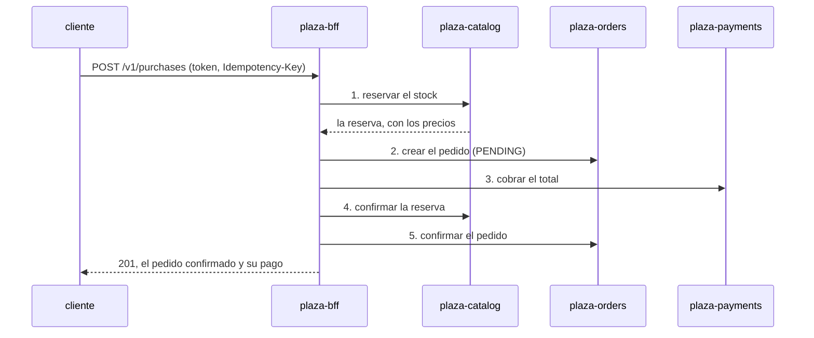

# plaza-bff

La entrada de [Plaza](https://github.com/ahincho/nova-plaza-01-shared-platform), en NestJS. Es lo único que ve el
cliente: valida su token de Keycloak, muestra el catálogo y sus pedidos, y **orquesta la compra** entre los tres
servicios, que no se llaman entre sí.

Las decisiones están en [ADR-043](https://github.com/ahincho/nova-shared-01-docs/blob/main/adrs/shared/ADR-043-plaza-la-plataforma-de-compras.md).
Nace del generador de Nova (`service --style bff`), y el primer commit es su salida sin editar.

## API

| Método | Ruta                 | Qué hace                                        | Token |
| ------ | -------------------- | ----------------------------------------------- | ----- |
| `GET`  | `/v1/products`       | el catálogo, por cursor (`?limit=`, `?cursor=`) | no    |
| `GET`  | `/v1/products/{sku}` | un producto, con lo que se puede reservar ahora | no    |
| `POST` | `/v1/purchases`      | compra el carrito; lleva `Idempotency-Key`      | sí    |
| `GET`  | `/v1/orders`         | los pedidos del cliente, por cursor             | sí    |
| `GET`  | `/v1/orders/{id}`    | un pedido del cliente                           | sí    |

Cada respuesta llega en el sobre de Nova, igual que la de cada servicio. La documentación está en `/docs`.

## La compra



| Si falla           | El BFF deshace, en orden inverso      | El cliente recibe                              |
| ------------------ | ------------------------------------- | ---------------------------------------------- |
| 1, reservar        | nada                                  | el error del catálogo, como 409 `OUT_OF_STOCK` |
| 2, crear el pedido | libera la reserva                     | el error de pedidos                            |
| 3, cobrar          | cancela el pedido y libera la reserva | 422 `PAYMENT_DECLINED` sobre el tope           |
| 4 o 5, confirmar   | reembolsa, cancela y libera           | el error del paso                              |

- **El error de un servicio llega con su forma.** Un 400, 404, 409 o 422 de un servicio sale del BFF con el mismo
  status y el mismo código; cualquier otro fallo, como un servicio caído, es un 502 o un 504 sin el detalle.
- **Nada se reintenta** (ADR-029). Cada llamada tiene su timeout, y un fallo compensa.
- **El estado de la saga vive solo en la petición:** el BFF no tiene base. Una compensación que falla se registra y no
  tapa el error original; no deja nada bloqueado, porque la reserva vence sola a los diez minutos.
- **Repetir la compra no cobra dos veces:** la misma `Idempotency-Key` viaja al pedido, y un pedido tiene un solo pago.

## El token

El BFF es el único que valida el token: la firma con las claves públicas de Keycloak, el emisor y el vencimiento, con
`jose`. Es la `verify` que el módulo de autenticación de Nova le pide al servicio. El cliente es el
`preferred_username` del token, y viaja solo a cada servicio en `X-Customer-Id`, la cabecera que los tres leen: ningún
punto de llamada lo pasa a mano.

## La arquitectura

El estilo `bff` del generador de Nova:

| Carpeta                                                    | Qué hay                                                 |
| ---------------------------------------------------------- | ------------------------------------------------------- |
| `features/products`                                        | el catálogo para cualquiera                             |
| `features/orders`                                          | los pedidos del cliente                                 |
| `features/purchases`                                       | la compra: el caso de uso, la saga y sus compensaciones |
| `upstream/catalog`, `upstream/orders`, `upstream/payments` | un cliente por servicio, sobre el cliente HTTP de Nova  |
| `shared`                                                   | la traducción del error de negocio de un servicio       |
| `auth`                                                     | la verificación del token contra Keycloak               |

`nova lint:arch` comprueba que un feature no conozca a otro, que un upstream no conozca a otro y que nada importe un
feature desde un upstream.

## Correrlo en local

Levantar Postgres, Vault y Keycloak desde
[`nova-plaza-01-shared-platform`](https://github.com/ahincho/nova-plaza-01-shared-platform), los tres servicios, y
después:

```bash
export CATALOG_URL=http://localhost:8082 ORDERS_URL=http://localhost:8081 PAYMENTS_URL=http://localhost:8083
export KEYCLOAK_ISSUER=http://localhost:8180/realms/plaza
pnpm install && pnpm start:dev
```

Escucha en el puerto 8080. Para comprar, se pide el token de `ana` a Keycloak y se llama con él:

```bash
TOKEN=$(curl -s -d grant_type=password -d client_id=plaza-demo -d username=ana -d password=ana-local \
  http://localhost:8180/realms/plaza/protocol/openid-connect/token | jq -r .access_token)
curl -s -X POST http://localhost:8080/v1/purchases -H "Authorization: Bearer $TOKEN" \
  -H "Idempotency-Key: demo-001" -H "Content-Type: application/json" \
  -d '{"items":[{"sku":"MUG-001","quantity":2}]}'
```

## Pruebas

```bash
pnpm verify
```

| Prueba                      | Qué cubre                                                                                                                                                   |
| --------------------------- | ----------------------------------------------------------------------------------------------------------------------------------------------------------- |
| `purchases.service.spec.ts` | la saga: el orden de los pasos y de cada compensación, y que una compensación que falla no tapa el error                                                    |
| `upstream-errors.spec.ts`   | qué error de un servicio llega al cliente con su forma                                                                                                      |
| `keycloak.spec.ts`          | el token: válido, de otro emisor, mal firmado y sin emisor configurado                                                                                      |
| `test/app.e2e-spec.ts`      | el BFF entero contra los tres servicios y un Keycloak falsos por HTTP: el token, la compra, el 409 sin stock, el 422 con su compensación y la documentación |

## Licencia

[Eclipse Public License 2.0](LICENSE).
